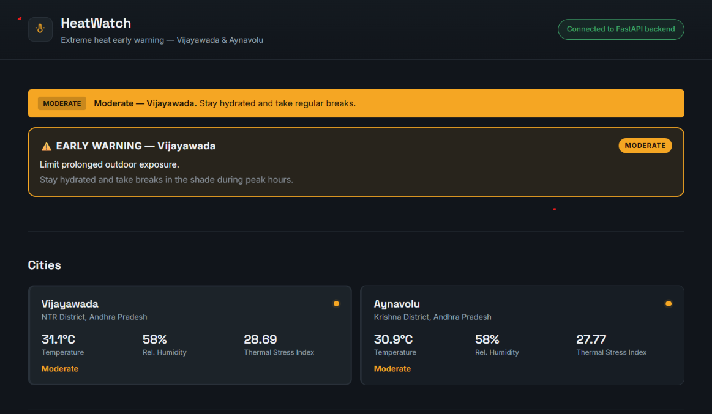
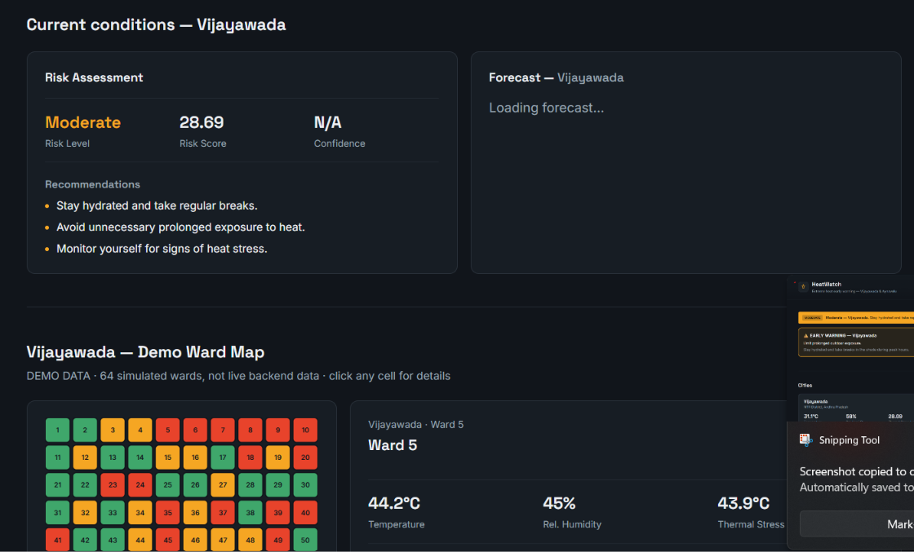
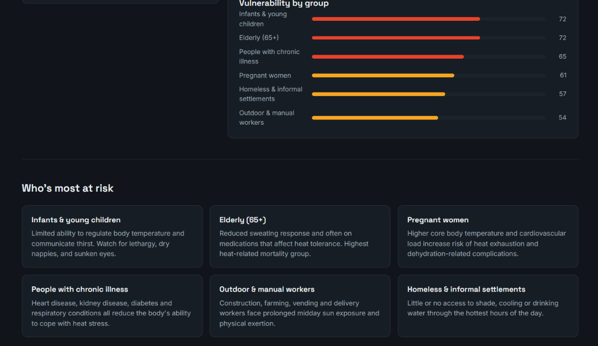
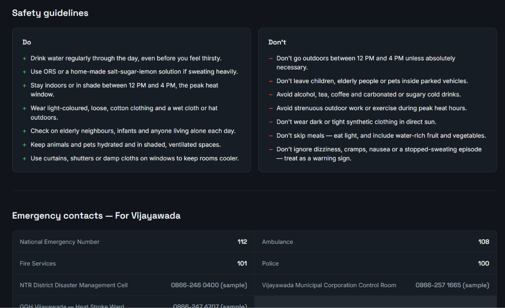

# 🔥 HeatGuard — Extreme Heatwave Early Warning System

SIH26083 — Extreme Heatwave Early Warning and Human Thermal Stress Index

## 📸 Project Preview

## 🚨 Problem statement: SIH26083
Extreme Heatwave Early warning and Human Thermal stress Index
    - Many parts of India is facing deaths and severe health issues due to extreme heatwaves.
    The current systems display only the temperature of the weather but a human body reacts differently for different conditions.
    Our solution HEATSHEILD  is proposed to calculate the thermal stress index of a person and give recommendations according to the level of thermal stress.
    Our system also provides prior early warning, so that people will not get effected by the unexpected rise in temperature and heatwaves.
    
## 💡 Solution
HeatShield is a web-based heat-stress monitoring system developed for **Smart India Hackathon 2026 – Problem Statement SIH26083**.
It combines weather data, thermal stress calculation, risk classification, recommendations, and forecast information into a single dashboard to help users understand heat-related risks.

## 🏗️System Flow
Frontend
   ↓
FastAPI Backend
   ↓
Weather Data
   ↓
Thermal Stress Calculation
   ↓
Risk Classification
   ↓
Recommendations
   ↓
Dashboard

## 🛠️ Technology Stack
Frontend
    - HTML
    - CSS
    - JavaScript
Backend
    - Python
    - FastAPI
    - Uvicorn
    - Pandas
DATA
    - Weather Data
    - Forecast Data
    - Thermak Stress Calculation
